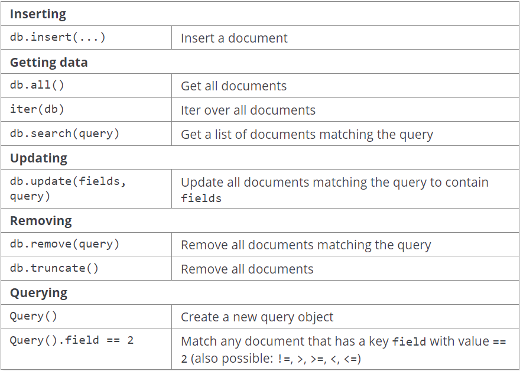

# Working-with-TinyDb

To install
```pip install tinydb```

It starts with import statements
```from tinydb import TinyDB, Query```

Then creating a database (db.json). Data will be Python dicts.
```db = TinyDB('db.json')```



